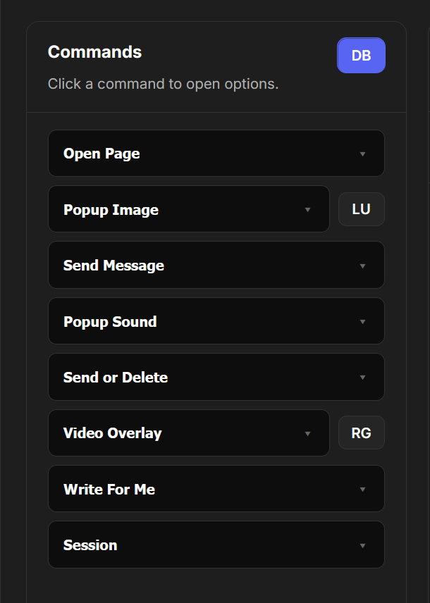
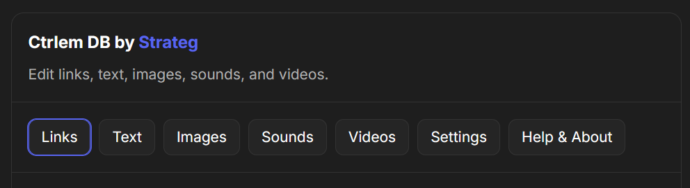

# Ctrlem DB

Built-in link database for images, videos, sounds, and texts. Automate Ctrl in your browser.

Ctrlem discord link: [Ctrlem - Discord](https://discord.gg/ctrlem).
Project and support: [Ctrlem DB Discussion - Discord](https://discord.com/channels/1465036592262676601/1505167683107160156).

Your links library (**DB**) keeps your media and text links organized in categories. Pick a category and send an item directly to CtrlEm.
Local Upload (**LU**) accepts images and folders through its buttons or drag and drop. Choose an image to upload it through CtrlEm.
**Redgifs (RG)** lets you send a Redgifs file from the native CtrlEm UI.

Auto-send lets you schedule links and uploads to send automatically at your chosen intervals.

## Screenshots

<table>
  <tr>
    <td width="40%" valign="top"></td>
    <td width="60%" valign="top"></td>
  </tr>
</table>
